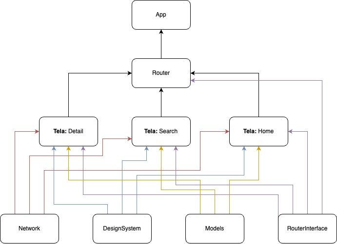

# Meli Busca - Processo seletivo Mercado Livre

<p align="center">
  
</p>

## Como rodar o projeto
Primeiro garanta que tem o XcodeGen instalado no seu Mac, para instruções de como instalar seguir o tutorial desse [link](https://github.com/yonaskolb/XcodeGen?tab=readme-ov-file#installing).

Esse projeto usa Swift 6.0, ou seja é necessário ter o Xcode 16 instalado na máquina caso esteja usando o Xcode 15 use a versão na branch `swift5-version` para conseguir rodar o projeto.

Com o XcodeGen instalado rode o seguinte comando:
```
xcodegen generate
```

Quando o projeto estiver gerado basta abrir o arquivo e rodar o target `App`

> [!WARNING]  
> Devido o projeto ter sido desenvolvido no Xcode 16.1 e Swift 6.0 ele usa a bibliotéca de teste Testing que não está disponivel para o Xcode 15, logo não é possivel rodar os testes na branch `swift5-version`

## Dependencias
### Dependencias de Build
 - [XcodeGen:](https://github.com/yonaskolb/XcodeGen)
    Usado para gerar automaticamente o projeto do XCode sem a necessidade do pbxproj ficar guardado no Git reduzindo os conflitos de Git
 - [SwiftGen:](https://github.com/SwiftGen/SwiftGen?tab=readme-ov-file)
    Usado para gerar arquivos de String e Cores para facilitar o uso dos mesmos
    OBS!: Devido a uma limitação do SwiftGen para Swift 6.0 é necessário marcar o `struct Colors` como `Sendable` já que o template atual não faz isso.
### Dependencias do Projeto
 - [SnapKit](https://github.com/SnapKit/SnapKit)
    Usado para facilitar a descrição de Constraints com ViewCode de forma mais simple

## Arquitetura e estrutura
### Arquitetura de Tela

<p align="center">
  
</p>

As telas estão organizadas na estrutura VIP (View - Interactor - Presenter) cada um desses elementos tem as seguintes responsabilidades:
- **View**: Descreve o Layout e lida com bindings de ações do usuário com campos de texto, células, botões e etc.
- **Interactor**: Executa as regras de négocio da tela, guarda o estado da tela e se comunica com serviços externos como APIs, DBs entre outros
- **Presenter**: Recebe uma parte do estado enviado pelo `Interactor`, deve adaptá-lo para um modelo de `ViewModel` para que a `View` o consuma e o renderize.

Essa estrutura permite separar bem lógica de négocios (`Interactor`), lógica de exibição (`Presenter`) e componentes visuais (`view`), dessa forma permitindo manter a view apenas com a parte visual e facilitando
a testabilidade dos outros componentes. Cada uma dessas estruturas é separada por protocolos de forma que é muito simples criar `spies` que permitam testar seu comportamento.

### Arquitetura de Módulos

<p align="center">
  
</p>

O Projeto está estruturado em pequenos módulos dentro do mesmo repósitorio (estrutura MonoRepo), cada módulo é um Pacote de [SPM](https://www.swift.org/documentation/package-manager/) linkado localmente via `XcodeGen` e a própria estrutura dos pacotes.

O App depende apenas do módulo de `Router` que é responsável por retornar a view correta para determinada rota, esse módulo depende dos módulos das telas e do módulo de interface do `Router`, esse módulo existe para que as telas consigam se comunicar com o Router sem depender dele diretamente, através de um módulo que contém apenas protocolos definindo o contrato de acesso ao Router.

As telas não tem nenhuma dependência entre elas, já que a navegação é feita pelo `RouterInterface` e delegado para o módulo de `Router`, e por fim os módulos de Model, DesignSystem e Network são módulos Core com classes reutilizadas pelos outros módulos.

## Pontos a melhorar
- CI/CD com Fastlane
- Sistema de injeção de dependencia usando [Swinject](https://github.com/Swinject/Swinject)
- Adicionar [SwiftLint](https://github.com/realm/SwiftLint) no Projeto
- Testes de Snapshot com [SnapshotTesting](https://github.com/pointfreeco/swift-snapshot-testing) para ViewControllers e Views
- Tokenização de Assets de imagens
